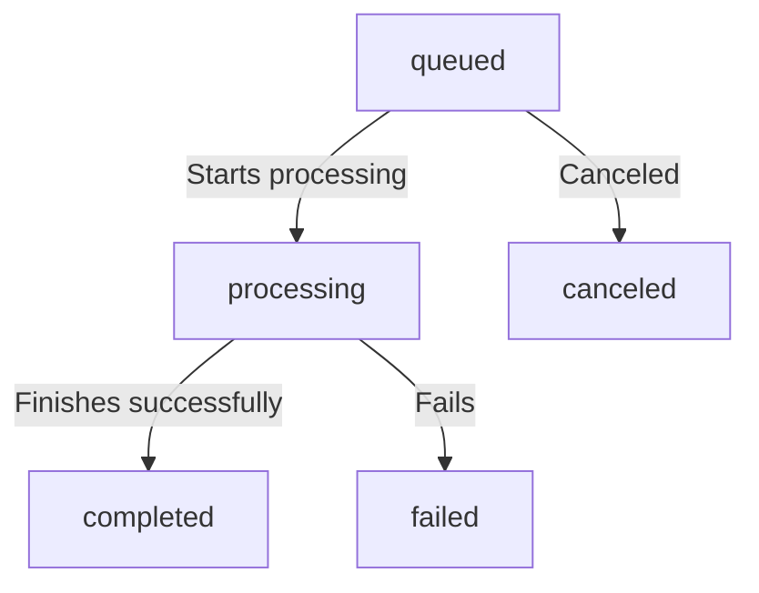

# Understanding Tasks in FFmate

In FFmate, a **task** is an individual FFmpeg job, whether it's transcoding, extracting audio, or applying filters. Tasks can be submitted **individually** or as part of a **batch**, allowing multiple files to be processed efficiently in a single request. Every task follows a structured **lifecycle**, progressing from submission to execution and ultimately reaching completion or failure.

Before diving into task execution, let's first go through the **lifecycle** of tasks and their corresponding **statuses** in FFmate.

| Status       | Description                                         |
|-------------|-----------------------------------------------------|
| `queued`     | The task is waiting to be processed.               |
| `processing` | The task is currently being executed by FFmpeg.   |
| `completed`  | The task has finished successfully.               |
| `failed`     | The task encountered an error during execution.   |
| `canceled`   | The task was manually canceled before completion. |

### Task Flow:

The diagram below shows how a task progresses through its lifecycle in FFmate



Next, let's explore how to trigger and manage single tasks in FFmate

## Creating a Task

To create a task, send a `POST` request to the FFmate API:

```sh
curl -X POST http://localhost:3000/api/v1/tasks \
     -H "Content-Type: application/json" \
     -d '{
       "command": "-y -i ${INPUT_FILE} -c:v libx264 -preset fast -crf 23 ${OUTPUT_FILE}",
       "inputFile": "videos/input.mp4",
       "outputFile": "videos/output.mp4",
       "priority": 2
     }'
```

### Task Properties

* **`command`** *\[mandatory]*

Defines the FFmpeg command to execute. FFmate **implicitly calls the FFmpeg binary**, so you only need to specify the **command-line parameters and flags**, without including `ffmpeg` itself.

* **`inputFile`** *\[optional]* – The path to the input media file that will be processed..

* **`outputFile`** *\[optional]* – The path where the transcoded file should be saved.

::: tip Handling Input and Output Files

* The **`inputFile`** and **`outputFile`** properties are **optional** and should only be used if your command includes the placeholders `${INPUT_FILE}` and `${OUTPUT_FILE}`.

* FFmate **automatically replaces** these placeholders with the actual file paths during execution.

* If your command **directly specifies input and output paths**, you do **not** need to provide these properties separately.
  :::

* **`priority`** *\[mandatory]* – Determines the execution order:
  * `1` → Low priority
  * `2` → Normal priority (default)
  * `3` → High priority
  * `4` → Critical priority (executed first)

After submitting a task, FFmate will respond with a JSON object containing the `taskId`. This `taskId` can be used to monitor the task’s progress in the next section.

## Monitoring a Task

Once submitted, you can check a task’s status by making a `GET` request:

```sh
curl -X 'GET' \
  'http://localhost:3000/api/v1/tasks/{taskId}' \
  -H 'accept: application/json'
```

Replace `{taskId}` with the actual task ID from the submission response.

## Monitoring All Tasks

FFmate allows you to retrieve a list of all tasks, regardless of their current state—whether they are waiting in the queue, actively processing, successfully completed, or encountered an error.

To retrieve a list of all tasks, send a GET request to the API:

```sh
curl -X 'GET' \
  'http://localhost:3000/api/v1/tasks?page=0&perPage=100' \
  -H 'accept: application/json'
```

**Query Parameters:**

* **`page`** *\[optional]* – Specifies which page of results to retrieve. Default: `0`.
* **`perPage`** *\[optional]* – Defines how many tasks should be included in each page. Default: `100`.

## Canceling a Task

FFmate allows you to cancel a task that is currently **queued** or **processing**. Once canceled, the task will not be executed or will be stopped if already in progress.

To cancel a task, make a `PATCH` request:

```sh
curl -X 'PATCH' \
  'http://localhost:3000/api/v1/tasks/{taskId}/cancel' \
  -H 'accept: application/json'
```

**Query Parameters:**

* **`{taskId}`** *\[mandatory]* – Specifies unique ID of the task you want to cancel.

> \[!NOTE]
> If the task is already processing, FFmate will attempt to **stop** it, but cancellation may not always be immediate.

## Restarting a Task

If a task has failed or been canceled, FFmate allows you to restart it without needing to resubmit the job manually.

To restart a task, send a `PATCH` request:

```sh
curl -X 'PATCH' \
  'http://localhost:3000/api/v1/tasks/{taskId}/restart' \
  -H 'accept: application/json'
```

**Query Parameters:**

* **`{taskId}`** *\[mandatory]* – The unique identifier of the task to restart.

> \[!TIP]
>
> * Restarting a task will **re-run the exact same command** using the original input and output paths.
> * If the task was previously processing, it will start from the beginning.

Once restarted, the task will move back into the **queued** state and follow the standard task lifecycle.

## Deleting a Task

Once a task is completed, canceled, or no longer needed, you can **permanently remove** it from FFmate.

To delete a task, make a `DELETE` request:

```sh
curl -X 'DELETE' \
  'http://localhost:3000/api/v1/tasks/{taskId}' \
  -H 'accept: application/json'
```

**Query Parameters:**

* **`{taskId}`** *(mandatory)* – The unique ID of the task to be deleted.

::: warning Important

* Deleting a task **removes the database entry** from FFmate but **does not** delete the input or output files.
* If the task is still processing, FFmate will attempt to **stop** it before deletion.
  :::

Okay, let's document how Batch Operations work in `ffmate`.

## Batch Operations: Processing Multiple Tasks Efficiently

`ffmate` allows you to submit multiple transcoding tasks in a single request, known as a "batch." This is particularly useful when you have a collection of files to process with similar (or different) settings, as it streamlines the submission process and helps `ffmate` manage them as a related group.

### What is a Batch?

When you submit multiple task definitions in one API call, `ffmate` assigns a unique **Batch ID** (a UUID) to all tasks created from that submission. This Batch ID serves as a common identifier for the group.

* **Individual Tasks:** Each item in your batch request still becomes an individual task within `ffmate`. This means each task will:
  * Go through its own lifecycle (Queued, Pre-Processing, Running, Post-Processing, Done).
  * Be processed independently by `ffmpeg` according to its specific settings (or preset).
  * Have its own progress, status, and potential errors.
* **No Inter-Task Dependency (by default):** `ffmate` processes tasks in a batch concurrently (up to the `max-concurrent-tasks` limit) or sequentially based on their priority and queue order. The success or failure of one task in a batch does not inherently affect other tasks *within the same batch* unless you implement such logic in your pre/post-processing scripts.

### How to Submit a Batch of Tasks

You submit a batch of tasks using the REST API by sending a `POST` request to the `/api/v1/tasks/batch` endpoint. The request body should be a JSON array, where each element in the array is a standard `NewTask` object (the same object you'd use for creating a single task via `/api/v1/tasks`).

**API Endpoint:** `POST /api/v1/tasks/batch`

**Request Body:** An array of `NewTask` objects.

**Example: Submitting a Batch of Two Tasks**

```json
// POST /api/v1/tasks/batch
[
  {
    "name": "Convert Episode 1 to WebM",
    "inputFile": "/mnt/source_videos/seriesA/episode_01.mov",
    "preset": "uuid-of-webm-720p-preset", // Reference a preset
    "priority": 20
  },
  {
    "name": "Convert Episode 2 to WebM",
    "inputFile": "/mnt/source_videos/seriesA/episode_02.mov",
    "preset": "uuid-of-webm-720p-preset",
    "priority": 20
  },
  {
    "name": "Extract Thumbnail for Promo Image",
    "command": "ffmpeg -ss 00:01:30 -i ${INPUT_FILE} -frames:v 1 -q:v 2 ${OUTPUT_FILE}",
    "inputFile": "/mnt/source_videos/seriesA/promo_material.mp4",
    "outputFile": "/mnt/output_images/promo_thumbnail_${TIMESTAMP_SECONDS}.jpg",
    "priority": 50
  }
]
```

**Response:**

Upon successful submission, `ffmate` will respond with a JSON array containing the full `Task` objects for each task created in the batch. Each of these task objects will include the same `batch` ID.

```json
// 200 OK
[
  {
    "uuid": "task-uuid-1",
    "batch": "batch-uuid-for-this-submission", // Same for all tasks in this batch
    "name": "Convert Episode 1 to WebM",
    "status": "QUEUED",
    // ... other task details
  },
  {
    "uuid": "task-uuid-2",
    "batch": "batch-uuid-for-this-submission", // Same for all tasks in this batch
    "name": "Convert Episode 2 to WebM",
    "status": "QUEUED",
    // ... other task details
  },
  {
    "uuid": "task-uuid-3",
    "batch": "batch-uuid-for-this-submission", // Same for all tasks in this batch
    "name": "Extract Thumbnail for Promo Image",
    "status": "QUEUED",
    // ... other task details
  }
]
```

### Managing and Monitoring Batches

While `ffmate` treats each task in a batch individually for processing, the Batch ID allows you to group and monitor them:

1. **Listing Tasks by Batch ID:**
   * You can retrieve all tasks belonging to a specific batch using the API:
     `GET /api/v1/tasks/batch/{batch_uuid}`
   * This is useful for checking the overall progress of a submitted batch.

2. **Webhooks:**
   * **`batch.created`**: This webhook event (if configured) fires once when a batch of tasks is successfully submitted. The payload will typically be an array of the created task DTOs.
   * **`batch.finished`**: This webhook event fires when *all* tasks belonging to a specific Batch ID have reached a terminal state (e.g., `DONE_SUCCESSFUL`, `DONE_ERROR`, `DONE_CANCELED`).
     * The payload for this webhook would likely provide a summary or list of the final states of all tasks in that batch. This is ideal for triggering follow-up actions once an entire set of related jobs is complete.

### Use Cases for Batch Operations

* **Bulk Transcoding:** Processing an entire folder of videos to a new format or resolution.
* **Multi-Rendition Generation:** Creating multiple versions (e.g., different bitrates, resolutions) of the same source file. Each rendition would be a separate task in the batch.
* **Sequential Asset Processing:** Submitting tasks for different stages of a media workflow (e.g., Task 1: Clean audio, Task 2: Transcode video, Task 3: Watermark) for a set of source files. While `ffmate` processes them based on queue rules, you can monitor them as a batch.
* **Simplifying Client Submissions:** Clients interacting with your `ffmate` instance can submit multiple related jobs in a single API call, reducing network overhead and simplifying their logic.

### Considerations

* **Error Handling:** If the overall batch submission request is malformed (e.g., invalid JSON), the entire request will fail. However, if the JSON array is valid but one of the individual `NewTask` objects within it is invalid (e.g., missing a required field if not using a preset), `ffmate` *may* reject the entire batch or process the valid tasks and report errors for the invalid ones. Check the API response and `ffmate` logs for specific behavior.
* **Resource Management:** Submitting very large batches can quickly fill up the task queue. `ffmate`'s `max-concurrent-tasks` setting will prevent system overload, but tasks will remain queued, potentially for a long time. Plan your batch sizes accordingly.

Batch operations in `ffmate` provide a convenient way to manage groups of related transcoding jobs, improving workflow efficiency and enabling more complex automation scenarios, especially when combined with webhooks like `batch.finished`.
