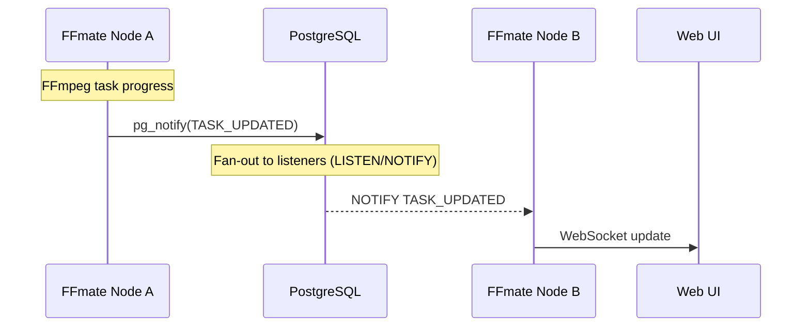

# Clustering  

**Clustering** in FFmate lets you run several instances connected to the same **PostgreSQL** database. They share a common queue, distribute jobs across nodes, and handle more tasks in parallel. It lets you go beyond the limits of a single machine while keeping the system resilient if one or more nodes in the cluster go down.

## When to Use Clustering  

Clustering is useful when:  

- You need to scale task throughput across multiple servers or containers.  
- You need redundancy, if one node fails, others keep working.  

At its core, clustering ensures that all nodes:  

- Share a single source of truth for the job queue.  
- Broadcast real-time updates to connected users, no matter which node runs the job.  


::: info
FFmate clusters aren’t limited to one platform. Windows, macOS, Linux, and Docker instances can all run side by side in the same cluster, as long as they connect to the same PostgreSQL database
:::

## Requirements  

- FFmate **v2.0 or later**. You can check your version with the [version command](/docs/flags.md#version-command).  
- A running **PostgreSQL database** that every node can access. See [Setting up PostgreSQL](#setting-up-postgresql) for details and options.  
- **Shared storage** (recommended) if nodes need access to the same media files.  

## Setup and Configuration  

All it takes to create a cluster of FFmate instances are three simple steps:

1. **Provision a PostgreSQL database** that all nodes can reach. 
2. **Create a user and database** inside PostgreSQL for FFmate.  
3. **Start each FFmate instance** with the same [--database](/docs/flags.md#server-command-flags) URI and a unique identifier:  

```bash
# Node A
ffmate server \
  --database="postgresql://user:pass@db_host:db_port/ffmate_db" \
  --identifier="node-a"
```

```bash
# Node B
ffmate server \
  --database="postgresql://user:pass@db_host:db_port/ffmate_db" \
  --identifier="node-b"
```

::: info
If you don’t set `--identifier`, FFmate defaults to the machine hostname. That works fine across machines, but it’s best practice to set an explicit identifier — especially if you run multiple nodes on the same host.
:::

# How Clustering Works  

When you run multiple FFmate instances against the same **PostgreSQL** database, they **automatically** form a cluster and split the work between them. The database makes sure each task is picked up by only one node, so jobs aren’t duplicated. Updates are shared with all nodes over WebSockets, so every UI shows the same state.

FFmate’s clustering is built on PostgreSQL’s `LISTEN/NOTIFY`: nodes publish with `pg_notify`; peers `LISTEN` and react. Simple and built-in—no separate broker needed.



## Watchfolders in a Cluster

FFmate clustering uses PostgreSQL transactions to make sure watchfolders don’t get processed twice. Here’s how it works:

- At each watchfolder **interval**, every node **queries** the database for watchfolders. The first node to claim one **locks it** and starts working. While it’s locked, other nodes see it’s locked and skip it. 
- When the **lock is released**, the next interval begins and the **cycle repeats**. This guarantees that only one node processes a watchfolder at a time, even if many are watching.

## Heartbeats

Every node sends a small “`I’m alive`” signal to the cluster about **every 15 seconds**. FFmate uses these heartbeats to show active nodes and flag any that have gone quiet in the Web UI.
 
## Node Failures

Clustering improves scalability and resilience, but it **isn’t a full high-availability setup**. If a node goes down mid-transcode, the task stays in `RUNNING`. There’s no built-in automatic failover or requeue. To recover, **restart** the task in the Web UI or via the API. That moves it back to `QUEUED` for another node to pick up.

## Cluster Debugging

FFmate comes with advanced debug options that are especially useful when **troubleshooting** cluster setups. If nodes aren’t joining or events aren’t flowing, enable the cluster namespaces: `info:cluster`, `debug:cluster`, `warn:cluster`, and `error:cluster`.

For more details on how debugging works in FFmate, see [Debugging](/docs/debugging.md).

## Setting up PostgreSQL

**Postgres** is one of the most powerful battle tested and use object-relational database in the world. There are various options to provision or deploy postgres and while this section is not meant to give an indeepth section, we want to highlight the various options you have to get a Postgres db up and running


### Deployment Options

FFmate needs a **PostgreSQL** instance that all nodes can reach. You’ve got a few ways to get there, depending on your environment and comfort level.

- **For local development**, Docker is usually the quickest route. Pull the official image, run a container, and you’ll have a database ready in minutes.  

    [Postgres on Docker Hub](https://hub.docker.com/_/postgres)

- **If you prefer installing directly on your machine**, PostgreSQL provides native installers for Windows, macOS, and Linux. This is handy if you want a bare-metal setup.  

    [Download PostgreSQL](https://www.postgresql.org/download/)  
    [Installation Guide](https://www.postgresql.org/docs/current/tutorial-install.html)

- **In production**, you can run a single PostgreSQL instance, but for more resilient setups it’s better to use a **high-availability cluster**. PostgreSQL has excellent built-in tools for this.  

    [Creating a Database Cluster](https://www.postgresql.org/docs/current/creating-cluster.html)

If you don’t want to install and run Postgres yourself, no problem! Services like [Supabase](https://supabase.com/database) and [Neon](https://neon.com) give you managed PostgreSQL with generous free tiers. You’ll have a database ready in minutes, without the low-level configuration or the headache of maintenance.

Once PostgreSQL is running—whether `self-hosted` or `managed`—you only need two extra steps:  

1. **Create a user** with permissions to `CONNECT, CREATE, SELECT, UPDATE, DELETE, and LISTEN/NOTIFY`.  

    [CREATE USER docs](https://www.postgresql.org/docs/current/sql-createuser.html)  

2. **Create a dedicated database** for FFmate.  

    [CREATE DATABASE docs](https://www.postgresql.org/docs/current/sql-createdatabase.html)

::: warning
Cluster performance depends on **network latency** between your nodes and the PostgreSQL server. Keep the database **close to your nodes whenever possible**.
:::
