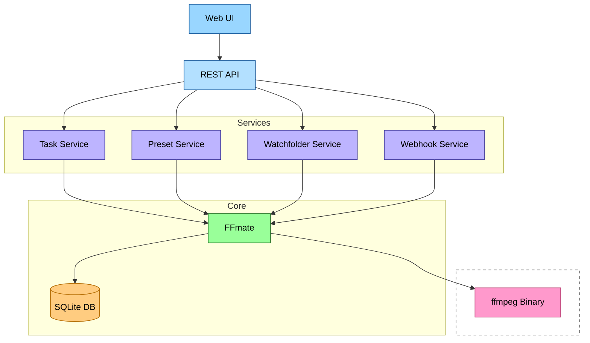

# FFmate Internals

This section provides a more in-depth look at some of `FFmate`'s key internal components and how they interact. Understanding these is key for advanced troubleshooting, fine-tuning configurations, and integrating ffmate into your workflows.

### High-Level Component Diagram



## REST API

The [REST API](/docs/swagger.md), is the primary way external clients (including the FFmate Web UI, scripts, or other services) interact with and control FFmate.

*   **Functionality:** Provides endpoints for CRUD (Create, Read, Update, Delete) operations on:
    *   Tasks (e.g., create single/batch, list, get status, cancel, restart, delete)
    *   Presets
    *   Watchfolders
    *   Webhooks

## SQLite Database

FFmate uses SQLite as its backend database to store all persistent data.
*   **Data Stored:**
    *   Tasks: All details about transcoding jobs, including their status, progress, input/output files, commands, priority, pre/post-processing info, timestamps, and any errors.
    *   Presets: Definitions for reusable transcoding templates.
    *   Webhooks: Configurations for URLs to be notified on specific events.
    *   Watchfolders: Settings for monitored directories, including paths, intervals, associated presets, and filters.

## Web UI

FFmate includes a modern [web-based user interface](/docs/web-ui.md)for managing and monitoring tasks, presets, watchfolders, and webhooks.

*   **Access:** When FFmate server starts, the web ui is served from the `/ui` path (e.g., `http://localhost:3000/ui`)
*   **Backend Communication:** The Web UI communicates with the FFmate service via:
    *   `REST API`: For actions like creating tasks, fetching lists, deleting presets, etc.
    *   `WebSockets`: For receiving real-time updates like task progress, new log messages, and status changes.

## Webhooks

[Webhooks](/docs/webhooks.md) allow FFmate to automatically notify external systems about specific events by sending HTTP POST requests to configured URLs.

*   **Configuration:**
    *   Users define webhooks via the `REST API` (`/api/v1/webhooks`).
    *   Each webhook configuration includes:
        *   **Event (`event`):** The specific FFmate event that will trigger this webhook (e.g., `task.created`, `task.updated`, `batch.finished`, `preset.deleted`).
        *   **URL (`url`):** The external HTTP(S) endpoint to which FFmate will send the notification.
*   **Triggering:** When a configured event occurs within FFmate:
    *   FFmate automatically sends an HTTP POST request.
    *   This request is sent to the `URL` defined in the webhook configuration.
    *   The body of the request contains a JSON payload detailing the `event` that occurred and relevant `data` associated with it.
*   **Payload Structure:**
    ```json
    {
      "event": "event.name.here",
      "data": { ... }
    }
    ```

## Watchfolder

The [Watchfolder](/docs/watchfolder.md) feature allows FFmate to monitor directories for new files and automatically create transcoding tasks for them based on a specified preset.

*   **Configuration:** Watchfolders are configured via the `REST API` or `Web UI`. Each configuration includes:
    *   **Path (`path`):** The directory to monitor.
    *   **Preset (`preset`):** The name of the preset to apply to newly detected files.
    *   **Interval (`interval`):** How often the directory is scanned (e.g., `10s`).
    *   **Filters (`filters`):** (Optional) Rules to include or exclude specific files (e.g., by extension).
    *   **Growth Checks (`growthChecks`):** (Optional) How many scan intervals a file must remain stable in size before being processed.
*   **Monitoring Process:**
    *   FFmate starts monitoring configured directories upon startup or configuration changes.
    *   Directories are scanned periodically based on the configured `interval`.
    *   New files are detected.
    *   Files are checked for stability (size consistency) based on `growthChecks` to ensure they are fully written.
    *   Configured `filters` are applied to the relevant files.
    *   A new task is automatically created for each stable, filtered file.
    *   The `preset` is applied to the new task.
    *   FFmate keeps track of processed files to avoid creating duplicate tasks.
*   **Dynamic Updates:** Changes to Watchfolder configurations (creation, updates, deletion) via the API or UI are dynamically loaded and applied without needing a FFmate restart.

## Task Queue

This is the core process where your transcoding jobs are managed and processed from submission to completion.

*   **Queueing:**
    *   New tasks (submitted via `API`, `Web UI`, or `Watchfolders`) are added to a queue.
    *   Tasks are processed based on their **Priority** (higher priority first) and then by creation time.
    *   Initially, tasks are in the `QUEUED` status.
*   **Concurrency Control:**
    *   FFmate limits the number of tasks running simultaneously.
    *   This limit is controlled by the `--max-concurrent-tasks` server setting.
    *   When a slot becomes available, the next task from the queue starts processing.
*   **Task Lifecycle:** Once a task is selected from the queue:
    *   Its status is updated to `RUNNING`.
    *   **Pre-processing:** If a pre-processing script is defined, it is executed before `ffmpeg`.
    *   **`ffmpeg` Execution:** The primary transcoding command (`ffmpeg`) is executed.
    *   **Progress Monitoring:** FFmate monitors `ffmpeg`'s output to track progress (e.g., percentage complete, time remaining). This progress is updated in the database and pushed via `WebSockets`.
    *   **Post-processing:** If a post-processing script is defined and `ffmpeg` completed successfully, the post-processing script is executed.
    *   **Completion:** The task status is updated to reflect the outcome: `DONE_SUCCESSFUL`, `DONE_ERROR`, or `DONE_CANCELED`. Error details are captured if applicable.
*   **Notifications:** Throughout a task's lifecycle, status changes and progress updates are broadcast via `WebSockets` (used by the `Web UI`) and can trigger configured `Webhooks`.