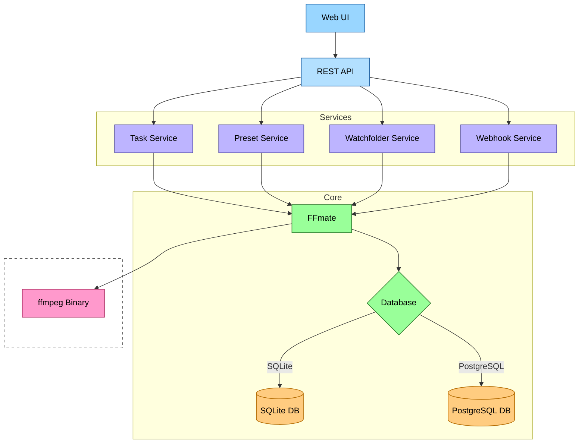

# FFmate Internals

This section breaks down FFmate’s core components and how they work together. It’s handy when you’re troubleshooting, tweaking settings, or plugging FFmate into your existing infrastructure

### High-Level Component Diagram



## REST API

The [REST API](/docs/swagger.md), is the primary way external clients (including the FFmate Web UI, scripts, or other services) interact with and control FFmate.

*   **Functionality:** Provides endpoints for CRUD (Create, Read, Update, Delete) operations on:

    *   Tasks – The core job management endpoints (e.g., create single or batch jobs, list all jobs, get real-time status, cancel, restart, and delete).
    *   Presets – Manage reusable transcoding templates (e.g., create, list, update, and delete presets).
    *   Watchfolders – Create jobs from a local or remote directory (e.g., create, list, update, and delete watch folder configurations).
    *   Webhooks – Configure and trigger real-time notifications for your own applications (e.g., create, list, update, delete, and view execution history).
    *   Clients – Monitor the instances in your cluster (e.g., list all connected nodes and their status).
    *   System & Status – Manage and monitor the FFmate (e.g., check instance health, get the application version, and adjust log verbosity at runtime).

## Database

FFmate supports **SQLite** for standalone instances (default out of the box) and **PostgreSQL** for clustered setups

*   **Data Stored:**
    *   Tasks: All details about transcoding jobs, including their status, progress, input/output files, commands, priority, pre/post-processing info, timestamps, and any errors.
    *   Presets: Definitions for reusable transcoding templates.
    *   Webhooks: Configurations for URLs to be notified on specific events.
    *   Watchfolders: Settings for monitored directories, including paths, intervals, associated presets, and filters.
    *   Clients: A list of each FFmate node connected to the database, with its ID, version, OS, and a heartbeat timestamp of when it was last online.

## Web UI

FFmate includes a modern [web-based user interface](/docs/web-ui.md)for managing and monitoring tasks, presets, watchfolders, webhooks and clients.

*   **Access:** When FFmate server starts, the web ui is served from the `/ui` path (e.g., `http://localhost:3000/ui`)
*   **Backend Communication:** The Web UI communicates with the FFmate service via:
    *   `REST API`: For actions like creating tasks, fetching lists, deleting presets, etc.
    *   `WebSockets`: For receiving real-time updates like task progress, new log messages, and status changes.

## Webhooks

[Webhooks](/docs/webhooks.md) allow FFmate to automatically notify external systems about specific events by sending HTTP POST requests to configured URLs.

*   **Configuration:**
    *   Users define webhooks via the `REST API` (`/api/v1/webhooks`) or [UI](/docs/web-ui.md#webhooks)  .
    *   Each webhook configuration includes:
        *   **Event (`event`):** The specific FFmate event that will trigger this webhook (e.g., `task.created`, `task.updated`, `batch.finished`, `preset.deleted`).
        *   **URL (`url`):** The external HTTP(S) endpoint to which FFmate will send the notification.
*   **Triggering:** When a configured event occurs within FFmate:
    *   FFmate automatically sends an HTTP POST request.
    *   This request is sent to the `URL` defined in the webhook configuration.
    *   The body of the request contains a JSON payload detailing the `event` that occurred and relevant `data` associated with it.
*   **Payload Structure:**
    ```json
    {
      "event": "event.name.here",
      "data": { ... }
    }
    ```

## Watchfolder

The [Watchfolder](/docs/watchfolder.md) feature allows FFmate to monitor directories for new files and automatically create transcoding tasks for them based on a specified preset.

*   **Configuration:** Watchfolders are configured via the `REST API` or `Web UI`. Each configuration includes:
    *   **Path (`path`):** The directory to monitor.
    *   **Preset (`preset`):** The name of the preset to apply to newly detected files.
    *   **Interval (`interval`):** How often the directory is scanned (e.g., `10s`).
    *   **Filters (`filters`):** (Optional) Rules to include or exclude specific files (e.g., by extension).
    *   **Growth Checks (`growthChecks`):** (Optional) How many scan intervals a file must remain stable in size before being processed.
*   **Monitoring Process:**
    *   FFmate starts monitoring configured directories upon startup or configuration changes.
    *   Directories are scanned periodically based on the configured `interval`.
    *   New files are detected.
    *   Files must remain the same size for the number of scans defined by `growthChecks` before they are considered ready for processing.
    *   Configured `filters` are applied to the relevant files.
        - If a file matches an extension in `exclude`, it will be skipped—even if it also matches `include`.
    *   A new task is automatically created for each stable, filtered file.
    *   The `preset` is applied to the new task.
    *   FFmate creates an empty `.lock` file next to it (e.g., `movie.mp4` → `movie.mp4.lock`). This permanent marker makes sure the file won’t be processed again by the watchfolder.
    *   FFmate keeps track of processed files to avoid creating duplicate tasks.
*   **Dynamic Updates:** Changes to Watchfolder settings (create, update, delete) in the API or UI are applied instantly, without the need for restarting FFmate.

## Task Queue

This is the core process where your transcoding jobs are managed and processed from submission to completion.

*   **Queueing:**
    *   New tasks (submitted via `API`, or `Watchfolders`) are added to a queue.
    *   Tasks are processed based on their **Priority** (higher priority first) and then by creation time.
    *   Initially, tasks are in the `QUEUED` status.
*   **Concurrency Control:**
    *   FFmate limits the number of tasks running simultaneously.
    *   This limit is controlled by the `--max-concurrent-tasks` server setting.
    *   When a slot becomes available, the next task from the queue starts processing.
*   **Task Lifecycle:** Once a task is selected from the queue:
    *   Its status is updated to `RUNNING`.
    *   **Pre-processing:** If a pre-processing script is defined, it is executed before `ffmpeg`.
    *   **`ffmpeg` Execution:** The primary transcoding command (`ffmpeg`) is executed.
    *   **Progress Monitoring:** FFmate monitors `ffmpeg`'s output to track progress (e.g., percentage complete, time remaining). This progress is updated in the database and pushed via `WebSockets`.
    *   **Post-processing:** If a post-processing script is defined and `ffmpeg` completed successfully, the post-processing script is executed.
    *   **Completion:** The task status is updated to reflect the outcome: `DONE_SUCCESSFUL`, `DONE_ERROR`, or `DONE_CANCELED`. Error details are captured if applicable.
*   **Notifications:** Throughout a task's lifecycle, status changes and progress updates are broadcast via `WebSockets` (used by the `Web UI`) and can trigger configured `Webhooks`.

### Health Endpoint

FFmate comes with a built-in **health endpoint** that shows if a node is up, initialized, and ready for requests.  

* **Endpoint:** `GET /health`

#### Responses

* **200 OK** — The node is running and connected to the database.  
  ```json
  {"status":"ok"}
  ```

* **500 Internal Server Error** — The node isn’t ready yet (e.g., during startup) or failed to connect.{"status":"error"}

#### When to Check It

This endpoint is meant for **automated health checks**. Tools like **Kubernetes**, **Docker Swarm**, or any **load balancer** can ping it to decide if a node is ready to take traffic or still alive.

::: info
This is a per-node check. A 200 OK means the node is running and connected to the database.It doesn’t confirm the state of other nodes or the pub/sub system.
:::

Example

```bash
curl http://localhost:3000/health
```

### Metrics

FFmate exposes a set of internal counters via the **`GET /metrics`** endpoint, formatted for a **Prometheus server**. These metrics are updated in real-time as events occur within the application and can be scraped to monitor FFmate's activity and health.

By default, you can access them at `http://localhost:3000/metrics`

*   **Batch Gauges**
    *   `ffmate_batch_created` – Total number of batches created.
    *   `ffmate_batch_finished` – Total number of batches where all associated tasks have completed (either successfully, with an error, or by being canceled).

    #### Example
    ```plain
    # HELP ffmate_batch_created Number of created batches
    # TYPE ffmate_batch_created gauge
    ffmate_batch_created 3
    # HELP ffmate_batch_finished Number of finished batches
    # TYPE ffmate_batch_finished gauge
    ffmate_batch_finished 2
    ```

*   **Task Gauges**
    *   `ffmate_task_created` – Total number of tasks added to the queue.
    *   `ffmate_task_deleted` – Total number of tasks that have been deleted.
    *   `ffmate_task_updated` – Total number of times a task's data has been updated (e.g., status change, progress update).
    *   `ffmate_task_canceled` – Total number of tasks that have been explicitly canceled by a user.
    *   `ffmate_task_restarted` – Total number of tasks that have been restarted.

    #### Example
    ```plain
    # HELP ffmate_task_created Number of created tasks
    # TYPE ffmate_task_created gauge
    ffmate_task_created 18
    ffmate_task_deleted 4
    ffmate_task_updated 155
    ffmate_task_canceled 1
    ffmate_task_restarted 1
    ```

*   **Preset Gauges**
    *   `ffmate_preset_created` – Total number of presets created.
    *   `ffmate_preset_updated` – Total number of presets that have been updated.
    *   `ffmate_preset_deleted` – Total number of presets that have been deleted.

    #### Example
    ```plain
    # HELP ffmate_preset_created Number of created presets
    # TYPE ffmate_preset_created gauge
    ffmate_preset_created 5
    ffmate_preset_updated 2
    ffmate_preset_deleted 1
    ```

*   **Webhook Gauges**
    *   `ffmate_webhook_created` – Total number of global webhooks created.
    *   `ffmate_webhook_updated` – Total number of global webhooks updated.
    *   `ffmate_webhook_deleted` – Total number of global webhooks deleted.
    *   `ffmate_webhook_executed` – Total number of times a global webhook has been fired.
    *   `ffmate_webhook_executed_direct` – Total number of times a "direct" webhook (defined inside a task or preset) has been fired.

    #### Example
    ```plain
    # HELP ffmate_webhook_created Number of created webhooks
    # TYPE ffmate_webhook_created gauge
    ffmate_webhook_created 4
    ffmate_webhook_updated 1
    ffmate_webhook_deleted 1
    ffmate_webhook_executed 12
    ffmate_webhook_executed_direct 25
    ```

*   **Watchfolder Gauges**
    *   `ffmate_watchfolder_created` – Total number of watch folders created.
    *   `ffmate_watchfolder_updated` – Total number of watch folders that have been updated.
    *   `ffmate_watchfolder_deleted` – Total number of watch folders that have been deleted.
    *   `ffmate_watchfolder_executed` – Total number of scan cycles that have been run across all watch folders.

    #### Example
    ```plain
    # HELP ffmate_watchfolder_created Number of created watchfolders
    # TYPE ffmate_watchfolder_created gauge
    ffmate_watchfolder_created 3
    ffmate_watchfolder_updated 1
    ffmate_watchfolder_deleted 0
    ffmate_watchfolder_executed 27
    ```

*   **Websocket Gauges**
    *   `ffmate_websocket_connect` – Total number of successful WebSocket connections.
    *   `ffmate_websocket_disconnect` – Total number of WebSocket disconnections.
    *   `ffmate_websocket_broadcast` – Total number of messages broadcast to all connected WebSocket clients.

    #### Example
    ```plain
    # HELP ffmate_websocket_connect Number of websocket connections
    # TYPE ffmate_websocket_connect gauge
    ffmate_websocket_connect 15
    # HELP ffmate_websocket_disconnect Number of websocket disconnections
    # TYPE ffmate_websocket_disconnect gauge
    ffmate_websocket_disconnect 13
    # HELP ffmate_websocket_broadcast Number of broadcasted messages
    # TYPE ffmate_websocket_broadcast gauge
    ffmate_websocket_broadcast 310
    ```

*   **REST API GaugeVec**
    *   `ffmate_rest_api{method, path}` – Counts all incoming HTTP requests, labeled by the HTTP method and the API route path.

    #### Example
    ```plain
    # HELP ffmate_rest_api Number of requests against the REST API
    # TYPE ffmate_rest_api gauge
    ffmate_rest_api{method="GET",path="/api/v1/tasks"} 5
    ffmate_rest_api{method="POST",path="/api/v1/tasks"} 10
    ```