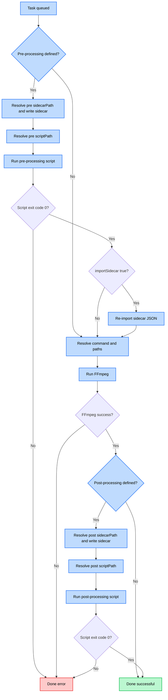

# Pre and Post-Processing

**Pre- and post-processing** in FFmate allow you to extend transcoding tasks by running custom scripts *before* the `ffmpeg` command starts and *after* it successfully completes. This powerful feature enables you to automate a wide range of activities, from input validation and file preparation to notifications, archiving, and integration with other systems.

You can define pre and post-processing steps either directly within a task creation request or as part of a [Preset](/docs/presets.md). If defined in both, the task-specific definition will take precedence.

## Configuration Parameters

For both pre-processing and post-processing, you can configure the following:

- **`scriptPath`** *[optional]* – The command or script FFmate should run before the main `ffmpeg` command. It supports [wildcards](/docs/wildcards.md) to pass dynamic values like filenames, UUIDs, or dates as arguments to your script.
    
*Example*: `python3 /opt/ffmate_scripts/prepare_audio.py --input ${INPUT_FILE} --normalize-level -3dBFS`

::: details **Note:** {open}
FFmate will attempt to run the `scriptPath` as a system command. Make sure the **script is executable** and the path is correct. It will run with the same environment and permissions as the FFmate process.

#### How Exit Codes Work

When a script finishes running, it returns an **exit code** — a number that tells `ffmate` whether it succeeded or failed.

- An exit code of `0` means the script completed successfully.
- A non-zero exit code means the script encountered an error.
  - For **pre-processing**, if the script fails, the `ffmpeg` command will *not* run, and the task will be marked as **failed**.
  - For **post-processing**, the `ffmpeg` command will already have completed successfully, but the task will still be marked as **failed** due to the post-processing error.
:::

- **`sidecarPath`** *[optional]* – Specifies the path where FFmate should write a JSON "sidecar" file containing detailed information about the current task. This path supports [wildcards](/docs/wildcards.md). Your script can then read this file to get full context and make decisions accordingly.

  - **What’s in the sidecard file?**  
    The sidecar JSON contains a snapshot of the task at the time the script runs:

    - For **pre-processing**, this includes input/output paths (raw or partially resolved), task metadata, UUID, name, priority, and more.

  #### Example:

  ```json
      {
    "uuid": "a1b2c3d4-e5f6-4a7b-8c9d-0e1f2a3b4c5d",
    "name": "My Epic Movie.mov",
    "command": {
      "raw": "-i ${INPUT_FILE} -c:v libx264 -preset fast ${OUTPUT_FILE}",
      "resolved": ""
    },
    "inputFile": {
      "raw": "/watch/My Epic Movie.mov",
      "resolved": ""
    },
    "outputFile": {
      "raw": "/output/${INPUT_FILE_BASENAME}.mp4",
      "resolved": ""
    },
    "metadata": {
      "show": "My Awesome Show",
      "season": 2,
      "episode": 5
    },
    "status": "PRE_PROCESSING",
    "progress": 0,
    "remaining": 0,
    "error": "",
    "priority": 5,
    "source": "watchfolder",
    "preProcessing": {
      "scriptPath": {
        "raw": "/scripts/preprocess.sh",
        "resolved": "/scripts/preprocess.sh"
      },
      "sidecarPath": {
        "raw": "/temp/${UUID}.json",
        "resolved": "/temp/a1b2c3d4-e5f6-4a7b-8c9d-0e1f2a3b4c5d.json"
      },
      "importSidecar": true,
      "startedAt": 1735689600000
    },
    "postProcessing": null,
    "startedAt": 0,
    "finishedAt": 0,
    "createdAt": 1735689590000,
    "updatedAt": 1735689600000
  }
    ```

    - For **post-processing**, it includes all of the above plus the final resolved output path from `ffmpeg`. The task status at this point will typically be `RUNNING`, just before it's marked `DONE_SUCCESSFUL` if post-processing completes without errors.


### Importing a Task’s Sidecar

When the property `importSidecar` is set to **true**, FFmate will **re-import the sidecar JSON after your pre-processing script finishes**.

The flow is simple:

1. When the task starts, FFmate writes the task’s [sidecar JSON](#example) to the path you configured in `preProcessing.sidecarPath`, then runs your pre-processing script.  
2. Inside your script, you can **read and modify the sidecar JSON** programmatically — but only by changing existing properties.  
3. When the script exits, FFmate re-imports the updated sidecar and continues processing the task with those updates.  

This lets you add custom logic to influence how FFmate processes a task. For example:  

- Run tools like `ffprobe` or `MediaInfo` and inject the results into the `metadata` object.  
- Adjust the [task’s](/docs/tasks.md#task-properties) command or preset dynamically based on resolution, bitrate, or aspect ratio.  
- Change the [task’s](/docs/tasks.md#task-properties) priority if the file comes from a specific location or matches certain conditions.  

> ⚠️ **Important:**  
> Only modify **existing properties** in the sidecar.  
> Do **not** add or remove keys or change the JSON structure; doing so will cause the FFmate task to fail.


Here’s an updated workflow that includes **sidecar import during pre-processing** (when `importSidecar` is true), plus a clean Mermaid diagram with valid syntax.

## Workflow

This section outlines how FFmate runs a task, showing where pre- and post-processing scripts fit, how wildcards are resolved, where the sidecar import happens, and how errors are handled.

1. **Task Queued** — A new task is created (directly or via a watchfolder).
2. **Pre-Processing (if defined)**
   - FFmate resolves wildcards in `sidecarPath` (if defined) and writes the task sidecar JSON.
   - FFmate resolves wildcards in `scriptPath`.
   - FFmate executes the pre-processing script.
   - If the script fails (non-zero exit code), the task status is set to `DONE_ERROR` and processing stops. The script error is logged.
   - **If `importSidecar` is true:** FFmate re-imports the updated sidecar JSON after the script finishes. If re-import fails, the task is set to `DONE_ERROR`.
3. **FFmpeg Processing**
   - If pre-processing was successful (or not defined), FFmate resolves wildcards for the main command, input file, and output file.
   - FFmate executes the FFmpeg command.
   - If FFmpeg fails, the task status is set to `DONE_ERROR` and processing stops. Post-processing will not run.
4. **Post-Processing (if defined)**
   - Assuming FFmpeg completed successfully, FFmate resolves wildcards in `sidecarPath` (if defined) and writes the task sidecar JSON (now including final output paths).
   - FFmate resolves wildcards in `scriptPath`.
   - FFmate executes the post-processing script.
   - If the script fails (non-zero exit code), the task status is set to `DONE_ERROR`. The script error is logged.
5. **Task Completion**
   - If post-processing was successful (or not defined), the task status is set to `DONE_SUCCESSFUL`.




##  Examples

#### Post-Processing – Upload to Cloud Storage and Notify

Once transcoding completes successfully, upload the output file to an S3 bucket and send a Slack notification to keep your team informed.

**Example:**

  This example shows how post-processing can be configured to run a custom script after a successful `ffmpeg` transcode, while also generating a sidecar JSON file containing task details.

  ```json
  {
    "postProcessing": {
      "scriptPath": "/opt/ffmate_scripts/upload_and_notify.sh",
      "sidecarPath": "${OUTPUT_FILE_DIR}/${OUTPUT_FILE_BASENAME}.post_task_info.json"
    }
    // ... other preset/task details
  }
  ```

*   **`upload_and_notify.sh` (Conceptual):**

    ```bash
    #!/bin/bash
    set -e # Exit immediately if a command exits with a non-zero status.

    SIDECAR_FILE=""

    # Basic argument parsing (robust scripts would use getopts)
    if [ "$1" == "--sidecar" ] && [ -n "$2" ]; then
        SIDECAR_FILE="$2"
    else
        # If ffmate passes sidecar path as the first arg directly
        SIDECAR_FILE="$1" 
    fi


    if [ -z "$SIDECAR_FILE" ] || [ ! -f "$SIDECAR_FILE" ]; then
        echo "Error: Sidecar file path not provided or file not found." >&2
        exit 1
    fi

    # Read data from sidecar using 'jq' (JSON processor)
    OUTPUT_FILE=$(jq -r '.outputFile.resolved' "$SIDECAR_FILE")
    TASK_NAME=$(jq -r '.name // "Untitled Task"' "$SIDECAR_FILE")
    TASK_UUID=$(jq -r '.uuid' "$SIDECAR_FILE")

    if [ -z "$OUTPUT_FILE" ]; then
        echo "Error: Could not extract output file from sidecar." >&2
        exit 1
    fi

    S3_BUCKET="s3://my-ffmate-outputs"
    SLACK_WEBHOOK_URL="https://hooks.slack.com/services/YOUR/SLACK/WEBHOOK"

    echo "Uploading ${OUTPUT_FILE} to ${S3_BUCKET}..."
    aws s3 cp "${OUTPUT_FILE}" "${S3_BUCKET}/"
    if [ $? -ne 0 ]; then
        echo "Error: S3 upload failed for ${OUTPUT_FILE}." >&2
        exit 2
    fi
    echo "Upload successful."

    # Send Slack notification
    MESSAGE_TEXT="Task Complete: '${TASK_NAME}' (UUID: ${TASK_UUID}). Output: ${S3_BUCKET}/$(basename "${OUTPUT_FILE}")"
    PAYLOAD="{\"text\": \"${MESSAGE_TEXT}\"}"

    curl -X POST -H 'Content-type: application/json' --data "${PAYLOAD}" "${SLACK_WEBHOOK_URL}"
    if [ $? -ne 0 ]; then
        echo "Warning: Slack notification failed, but file was uploaded." >&2
        # Decide if this should be a hard fail (exit 3) or just a warning
    fi

    echo "Post-processing complete for ${TASK_UUID}."
    exit 0 # Success
    ```