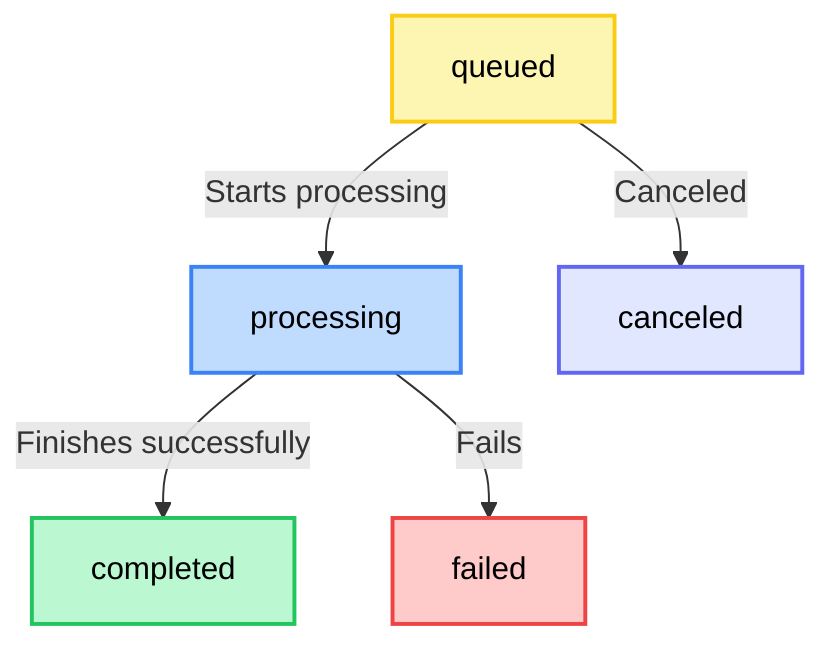

# Understanding Tasks in FFmate

In FFmate, a **task** represents a single FFmpeg command execution such as transcoding a video, extracting audio, or applying filters. When you submit a task, FFmate uses FFmpeg under the hood to perform the media processing. Tasks can be submitted on their own or grouped into batches to handle multiple files efficiently in one go  
Every task follows a structured **lifecycle**, progressing from submission to execution and ultimately reaching completion or failure.


Before diving into task execution, let's first go through the **lifecycle** of tasks and their corresponding **statuses** in FFmate.

| Status       | Description                                         |
|-------------|-----------------------------------------------------|
| `queued`     | The task is waiting to be processed.               |
| `processing` | The task is currently being executed by FFmpeg.   |
| `completed`  | The task has finished successfully.               |
| `failed`     | The task encountered an error during execution.   |
| `canceled`   | The task was manually canceled before completion. |

### Task Flow:
The diagram below shows how a task progresses through its lifecycle in FFmate



Next, let's explore how to trigger and manage single tasks in FFmate

## Creating a Task

To create a task, send a `POST` request to the FFmate API:

```sh
curl -X POST http://localhost:3000/api/v1/tasks \
     -H "Content-Type: application/json" \
     -d '{
       "command": "-y -i ${INPUT_FILE} -c:v libx264 -preset fast -crf 23 ${OUTPUT_FILE}",
       "inputFile": "videos/input.mp4",
       "outputFile": "videos/output.mp4",
       "priority": 2
     }'
```

### Task Properties

These are the properties you can set when creating a task in FFmate:

-   **`name`** *[optional]* -A short, descriptive name to help identify and track the task in the web UI and API (e.g., "Convert wedding video to MP4")

- **`command`** *[mandatory]* - Define the FFmpeg command to run. FFmate automatically invokes the FFmpeg binary, so you only need to provide the command-line arguments—no need to include `ffmpeg` at the start.

- **`inputFile`** *[optional]* – The path to the input media file that will be processed.

- **`outputFile`** *[optional]* – The path where the transcoded file should be saved.

::: tip Handling Input and Output Files

- The **`inputFile`** and **`outputFile`** properties are **optional** and should only be used if your command includes the placeholders `${INPUT_FILE}` and `${OUTPUT_FILE}`.
- FFmate **automatically replaces** these placeholders with the actual file paths during execution.
- If your command **directly specifies input and output paths**, you do **not** need to provide these properties separately.
:::

- **`priority`** *[mandatory]* – Determines the execution order:
  - `1` → Low priority
  - `2` → Normal priority (default)
  - `3` → High priority
  - `4` → Critical priority (executed first)

-   **`preset`** *[optional]* - The UUID of a pre-configured [Preset](/docs/presets.md) to use for this task.

- **`preProcessing`** *[optional]* – Defines a [Pre-Processing Script](/docs/pre-post-prcessing.md) to run before the task starts. Useful for preparing files, validating input, or setting up the environment.
    *   **`scriptPath`**: Command/path to the script.
    *   **`sidecarPath`**: (Optional) Path for the task data JSON file.

- **`postProcessing`** *[optional]* – Defines a [Post-Processing Script](/docs/pre-post-prcessing.md) to run after the task completes. Useful for cleanup, moving output files, or triggering follow-up actions.
    *   **`scriptPath`**: Command/path to the script.
    *   **`sidecarPath`**: (Optional) Path for the task data JSON file.

- **`metadata`** *[optional]* – A JSON object for including custom key-value pairs with the task. Useful for adding context, referencing source files, or integrating with external systems.

::: details **Example:** {open}

A sample `metadata` object containing useful context about the source file, provided as key-value pairs:

```json
"metadata": {
  "original_filename": "interview_session_03_cam_A.mxf",
  "project_code": "PROJ-SUMMER2025",
  "editor_notes": "Needs color correction pass after this transcode."
}
```
:::

This is a powerful feature for:

- **`Identifying the Source Asset:`** Store unique identifiers from your originating system (e.g., a CMS asset ID, a DAM UUID, a production tracking code). This allows you to easily correlate the `FFmate` task back to its source.  

- **`Workflow Integration:`** Include metadata like project IDs, Naming conventions, or destination apths to help downstream systems—such as asset managers, review platforms, or render farms—automate and coordinate their tasks.

After submitting a task, FFmate will respond with a JSON object containing the `taskId`. This `taskId` can be used to monitor the task’s progress in the next section.

## Monitoring a Task

Once submitted, you can check a task’s status by making a `GET` request:

```sh
curl -X 'GET' \
  'http://localhost:3000/api/v1/tasks/{taskId}' \
  -H 'accept: application/json'
```

Replace `{taskId}` with the actual task ID from the submission response.

💡 Tip: You can also check the status of each task directly in the FFmate Web UI [FFmate Web UI](/docs/web-ui.md)


## Monitoring All Tasks

FFmate lets you retrieve a list of all tasks, no matter their current state—queued, processing, completed, or failed.

To retrieve a list of all tasks, send a GET request to the API:

```sh
curl -X 'GET' \
  'http://localhost:3000/api/v1/tasks?page=0&perPage=100' \
  -H 'accept: application/json'
```

**Query Parameters:**

- **`page`** *[optional]* – Specifies which page of results to retrieve. Default: `0`.
- **`perPage`** *[optional]* – Defines how many tasks should be included in each page. Default: `100`.

💡 Tip: You can also check the status of all tasks: queued, processing, completed, or failed directly in the [FFmate Web UI](/docs/web-ui.md)


## Canceling a Task

FFmate lets you to cancel a task that is currently **queued** or **processing**. Once canceled, the task will not be executed or will be stopped if already in progress.

To cancel a task, make a `PATCH` request:

```sh
curl -X 'PATCH' \
  'http://localhost:3000/api/v1/tasks/{taskId}/cancel' \
  -H 'accept: application/json'
```

**Query Parameters:**

- **`{taskId}`** *[mandatory]* – Specifies unique ID of the task you want to cancel.

> [!NOTE]
> If the task is already processing, FFmate will attempt to **stop** it, but cancellation may not always be immediate.

💡 Tip: You can also cancel a running task directly from the [FFmate Web UI](/docs/web-ui.md) with a single click—no API call needed.

## Restarting a Task

If a task has failed or been canceled, FFmate allows you to restart it without needing to resubmit the job manually.

To restart a task, send a `PATCH` request:

```sh
curl -X 'PATCH' \
  'http://localhost:3000/api/v1/tasks/{taskId}/restart' \
  -H 'accept: application/json'
```

**Query Parameters:**

- **`{taskId}`** *[mandatory]* – The unique identifier of the task to restart.

> [!Note]
> - Restarting a task will **re-run the exact same command** using the original input and output paths.  
> - If the task was previously processing, it will start from the beginning.

Once restarted, the task will move back into the **queued** state and follow the standard [task lifecycle](#task-flow).

💡 Tip: Need to rerun a task? You can restart it directly in the [FFmate Web UI](/docs/web-ui.md)

## Deleting a Task

Once a task is completed, canceled, or no longer needed, you can **permanently remove** it from FFmate.

To delete a task, make a `DELETE` request:

```sh
curl -X 'DELETE' \
  'http://localhost:3000/api/v1/tasks/{taskId}' \
  -H 'accept: application/json'
```

**Query Parameters:**
- **`{taskId}`** *(mandatory)* – The unique ID of the task to be deleted.

::: warning Important
- Deleting a task **removes the database entry** from FFmate but **does not** delete the input or output files.  
- If the task is still processing, FFmate will attempt to **stop** it before deletion.
:::

💡 Tip: Tasks can also be deleted from the [FFmate Web UI](/docs/web-ui.md)

## Submitting Multiple Tasks as a Batch

FFmate allows you to submit multiple transcoding tasks in a single request, referred to as a `batch`. This is ideal when processing a set of files—whether they use the same settings or different ones—as it simplifies submission and keeps related tasks grouped together.

Each batch is automatically assigned a unique `batch ID`, making it easy to monitor, manage, and reference the entire group of tasks as a single unit. While a batch groups multiple task submissions together, each task within it remains fully independent.

- **Individual Tasks:**  
  Every task in the batch is submitted as a standalone task in FFmate. This means:
  - Each task follows its own lifecycle (`Queued`, `Pre-Processing`, `Running`, `Post-Processing`, `Done`).
  - Each is executed independently by `ffmpeg`, based on its own command or preset.
  - Each task maintains its own progress, status, and error reporting.

- **No Inter-Task Dependency (by default):**  
  FFmate processes batch tasks concurrently (up to the `max-concurrent-tasks` limit) or sequentially, based on priority and queue order.  
  
> [!NOTE]
> One task's success or failure does not affect others in the same batch.
  
### How to Submit a Batch of Tasks

You submit a batch of tasks using the REST API by sending a `POST` request to the `/api/v1/tasks/batch` endpoint. 

The request body will be a JSON array, where each element in the array is a standard `Task` object (the same object you'd use for creating a single task via [/api/v1/tasks](#creating-a-task).

To submit multiple tasks as a batch, send a `POST` request to the FFmate API:

```sh
curl -X POST http://localhost:3000/api/v1/tasks/batch \
     -H "Content-Type: application/json" \
     -d '[
       {
         "name": "Convert Episode 1 to WebM",
         "inputFile": "/mnt/source_videos/seriesA/episode_01.mov",
         "preset": "uuid-of-webm-720p-preset",
         "priority": 20
       },
       {
         "name": "Convert Episode 2 to WebM",
         "inputFile": "/mnt/source_videos/seriesA/episode_02.mov",
         "preset": "uuid-of-webm-720p-preset",
         "priority": 20
       },
       {
         "name": "Extract Thumbnail for Promo Image",
         "command": "ffmpeg -ss 00:01:30 -i ${INPUT_FILE} -frames:v 1 -q:v 2 ${OUTPUT_FILE}",
         "inputFile": "/mnt/source_videos/seriesA/promo_material.mp4",
         "outputFile": "/mnt/output_images/promo_thumbnail_${TIMESTAMP_SECONDS}.jpg",
         "priority": 50
       }
     ]'

```

**Response:**

Upon successful submission, FFmate will respond with a JSON array containing the full `Task` objects for each task created in the batch. Each of these task objects will include the same `batch` ID.

```json{4,11,18}
[
  {
    "uuid": "task-uuid-1",
    "batch": "c4e8f12a-3b7d-4c9f-a1e8-5d0f2b3c4a9e", 
    "name": "Convert Episode 1 to WebM",
    "status": "QUEUED",
    // ... other task details
  },
  {
    "uuid": "task-uuid-2",
    "batch": "c4e8f12a-3b7d-4c9f-a1e8-5d0f2b3c4a9e", 
    "name": "Convert Episode 2 to WebM",
    "status": "QUEUED",
    // ... other task details
  },
  {
    "uuid": "task-uuid-3",
    "batch": "c4e8f12a-3b7d-4c9f-a1e8-5d0f2b3c4a9e", 
    "name": "Extract Thumbnail for Promo Image",
    "status": "QUEUED",
    // ... other task details
  }
]
```

### Managing and Monitoring Batches

While FFmate treats each task in a batch individually for processing, the `batch ID` allows you to group and monitor them as a unit.

**Listing Tasks by Batch ID**

You can retrieve all tasks belonging to a specific batch using the following API endpoint:

```sh
curl -X 'GET' \
  'http://localhost:3000/api/v1/tasks/batch/{batch_uuid}' \
  -H 'accept: application/json'
```

::: tip 💡 Webhook Notifications for Batches

**Webhooks Aren’t Just for Tasks — Use Them to Track Batches Too**

- **`batch.created`** – Triggered once when a batch of tasks is successfully submitted. The payload includes an array of the created task objects.

- **`batch.finished`** – Triggered when all tasks in the batch have finished processing (either successfully, with errors, or canceled).  

  The payload includes a summary of each task's final status, making this ideal for triggering follow-up actions once the entire batch is complete.

:::

### Common Use Cases for Batch Submission

- **Bulk Transcoding** – Convert an entire folder of videos to a new format or resolution in one go.

- **Multi-Renditions** – Generate multiple versions of the same source file (e.g., different bitrates or resolutions). Each rendition is submitted as an individual task within the batch.

- **Sequential Asset Processing** – Submit tasks that represent different steps in a media pipeline (e.g., clean audio, transcode video, apply watermark). While FFmate handles each task independently based on queue rules, you can still track them together as part of a single batch. While `ffmate` processes them based on queue rules, you can monitor them as a batch.