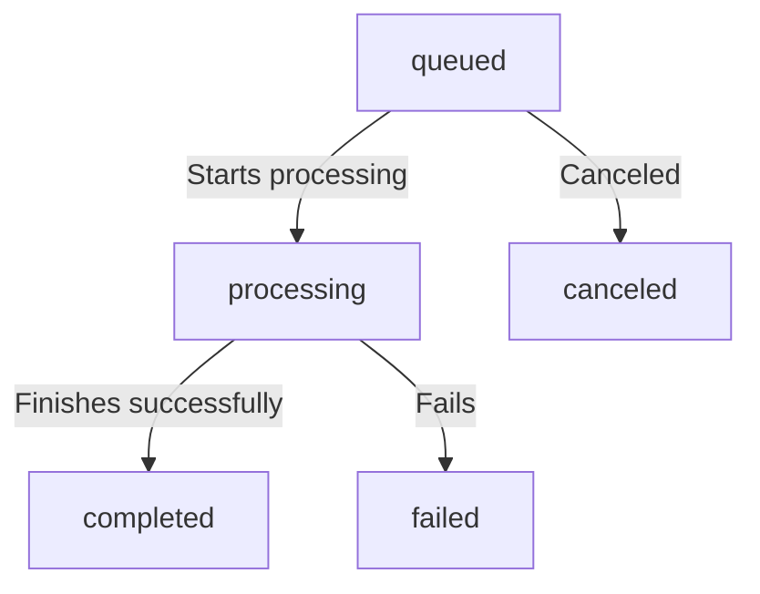

# Understanding Tasks in FFmate

In FFmate, a **task** is an individual FFmpeg job, whether it's transcoding, extracting audio, or applying filters. Tasks can be submitted **individually** or as part of a **batch**, allowing multiple files to be processed efficiently in a single request. Every task follows a structured **lifecycle**, progressing from submission to execution and ultimately reaching completion or failure.

Before diving into task execution, let's first go through the **lifecycle** of tasks and their corresponding **statuses** in FFmate.

| Status       | Description                                         |
|-------------|-----------------------------------------------------|
| `queued`     | The task is waiting to be processed.               |
| `processing` | The task is currently being executed by FFmpeg.   |
| `completed`  | The task has finished successfully.               |
| `failed`     | The task encountered an error during execution.   |
| `canceled`   | The task was manually canceled before completion. |

### Task Flow:
The diagram below shows how a task progresses through its lifecycle in FFmate



Next, let's explore how to trigger and manage single tasks in FFmate

## 📝 Creating a Task

To create a task, send a `POST` request to the FFmate API:

```sh
curl -X POST http://localhost:3000/api/v1/tasks \
     -H "Content-Type: application/json" \
     -d '{
       "command": "-y -i ${INPUT_FILE} -c:v libx264 -preset fast -crf 23 ${OUTPUT_FILE}",
       "inputFile": "videos/input.mp4",
       "outputFile": "videos/output.mp4",
       "priority": 2
     }'
```

### 📌 Task Properties

- **`command`** *[mandatory]*

Defines the FFmpeg command to execute. FFmate **implicitly calls the FFmpeg binary**, so you only need to specify the **command-line parameters and flags**, without including `ffmpeg` itself.

- **`inputFile`** *[optional]* – The path to the input media file that will be processed..

- **`outputFile`** *[optional]* – The path where the transcoded file should be saved.

::: tip Handling Input and Output Files

- The **`inputFile`** and **`outputFile`** properties are **optional** and should only be used if your command includes the placeholders `${INPUT_FILE}` and `${OUTPUT_FILE}`.
- FFmate **automatically replaces** these placeholders with the actual file paths during execution.
- If your command **directly specifies input and output paths**, you do **not** need to provide these properties separately.
:::

- **`priority`** *[mandatory]* – Determines the execution order:
  - `1` → Low priority
  - `2` → Normal priority (default)
  - `3` → High priority
  - `4` → Critical priority (executed first)

After submitting a task, FFmate will respond with a JSON object containing the `taskId`. This `taskId` can be used to monitor the task’s progress in the next section.

---

## 🔍 Monitoring a Task

Once submitted, you can check a task’s status by making a `GET` request:

```sh
curl -X 'GET' \
  'http://localhost:3000/api/v1/tasks/{taskId}' \
  -H 'accept: application/json'
```

Replace `{taskId}` with the actual task ID from the submission response.

---

## 🔍 Monitoring All Tasks

FFmate allows you to retrieve a list of all tasks, regardless of their current state—whether they are waiting in the queue, actively processing, successfully completed, or encountered an error.

To retrieve a list of all tasks, send a GET request to the API:

```sh
curl -X 'GET' \
  'http://localhost:3000/api/v1/tasks?page=0&perPage=100' \
  -H 'accept: application/json'
```

**Query Parameters:**

- **`page`** *[optional]* – Specifies which page of results to retrieve. Default: `0`.
- **`perPage`** *[optional]* – Defines how many tasks should be included in each page. Default: `100`.

---

## 🛑 Canceling a Task

FFmate allows you to cancel a task that is currently **queued** or **processing**. Once canceled, the task will not be executed or will be stopped if already in progress.

To cancel a task, make a `PATCH` request:

```sh
curl -X 'PATCH' \
  'http://localhost:3000/api/v1/tasks/{taskId}/cancel' \
  -H 'accept: application/json'
```

**Query Parameters:**

- **`{taskId}`** *[mandatory]* – Specifies unique ID of the task you want to cancel.

> [!NOTE]
> If the task is already processing, FFmate will attempt to **stop** it, but cancellation may not always be immediate.

---

## 🔄 Restarting a Task

If a task has failed or been canceled, FFmate allows you to restart it without needing to resubmit the job manually.

To restart a task, send a `PATCH` request:

```sh
curl -X 'PATCH' \
  'http://localhost:3000/api/v1/tasks/{taskId}/restart' \
  -H 'accept: application/json'
```

**Query Parameters:**

- **`{taskId}`** *[mandatory]* – The unique identifier of the task to restart.

> [!TIP]
> - Restarting a task will **re-run the exact same command** using the original input and output paths.  
> - If the task was previously processing, it will start from the beginning.

Once restarted, the task will move back into the **queued** state and follow the standard task lifecycle.

---

## 🗑️ Deleting a Task

Once a task is completed, canceled, or no longer needed, you can **permanently remove** it from FFmate.

To delete a task, make a `DELETE` request:

```sh
curl -X 'DELETE' \
  'http://localhost:3000/api/v1/tasks/{taskId}' \
  -H 'accept: application/json'
```

**Query Parameters:**
- **`{taskId}`** *(mandatory)* – The unique ID of the task to be deleted.

::: warning Important
- Deleting a task **removes the database entry** from FFmate but **does not** delete the input or output files.  
- If the task is still processing, FFmate will attempt to **stop** it before deletion.
:::

---