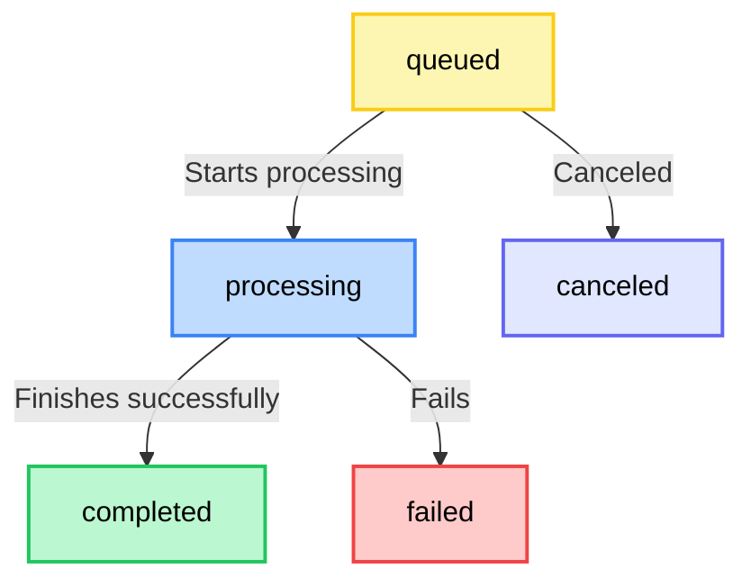

# Understanding Tasks in FFmate

A **task** in FFmate represents an `FFmpeg` command execution such as transcoding a video, extracting audio, or applying filters. 

When you submit a task, FFmate triggers `FFmpeg` under the hood to perform the media processing. Tasks can be submitted on their own or grouped into `batches` to handle multiple files efficiently in one go.

Every task follows a structured **lifecycle**, progressing from submission to execution and ultimately reaching completion or failure.


Before diving into task execution, let's first go through the **lifecycle** of tasks and their corresponding **statuses** in FFmate.

| Status            | Description                                       |
|-------------------|---------------------------------------------------|
| `QUEUED`          | The task is waiting in the processing queue      |
| `PRE_PROCESSING`  | The task's pre-processing script is running      |
| `RUNNING`         | The main FFmpeg command is currently executing   |
| `POST_PROCESSING` | The task's post-processing script is running     |
| `DONE_SUCCESSFUL` | The task completed successfully                  |
| `DONE_ERROR`      | The task encountered an error and failed         |
| `DONE_CANCELED`   | The task was manually canceled before completion |

### Task Flow:
The diagram below shows how a task progresses through its lifecycle in FFmate



Next, let's explore how to trigger and manage single tasks in FFmate

## Creating a Task

To create a task, send a `POST` request to the FFmate API:

```sh
curl -X POST http://localhost:3000/api/v1/tasks \
     -H "Content-Type: application/json" \
     -d '{
       "command": "-y -i ${INPUT_FILE} -c:v libx264 -preset fast -crf 23 ${OUTPUT_FILE}",
       "inputFile": "videos/input.mp4",
       "outputFile": "videos/output.mp4",
       "priority": 2
     }'
```

FFmate responds with a JSON object that contains the newly created task including its `ID`. This `taskId` can be used to monitor the task’s progress in the next section. An `task.created` event is also fired via [webhooks](/docs/webhooks#task-events)

### Task Properties

These are the properties you can set when creating a task in FFmate:

- **`name`** *[optional]* - A short, descriptive name to help identify and track the task in the web UI and API (e.g., "Convert wedding video to MP4")

- **`command`** — The custom command FFmate will use to run `FFmpeg`. This field is **mandatory** unless you use a `preset`.  

  ⚠️ **Important details about how `command` works:** 

  - You don’t need to add `ffmpeg` at the start of the command. FFmate automatically prepends it. By default, FFmate uses the `ffmpeg` binary in your system’s `PATH`. If you want to use a different version, you can override the default with the `--ffmpeg <path>` [command-line flag](/docs/flags.md#server-command-flags).  

  - FFmate also implicitly adds the `-stats_period 1` [option](https://ffmpeg.org/ffmpeg-all.html#Advanced-options) to every command, which limits FFmpeg’s progress output to one update per second.  
    
    You can override this by explicitly adding your own `-stats_period x` to the command.  
    - This setting directly affects:  
      - how often `task.updated` [webhook](/docs/webhooks#task-events) is sent, and  
      - how often the job dashboard refreshes progress updates.  

    - The `command` field also supports chaining multiple `FFmpeg` commands with `&&`. This is useful for advanced workflows such as **two-pass encoding**. When chaining commands, you must use the `${FFMPEG}` wildcard (see [FFmpeg Path](/docs/wildcards.md#ffmpeg-path) for more details). 
  
      You can also use [wildcards](/docs/wildcards.md) like `${INPUT_FILE}` and `${OUTPUT_FILE}` inside the command string. FFmate will automatically replace them with the actual file paths when the task runs.

  ::: tip Not sure which `FFmpeg` commands to use?

  - [OSTechNix – 20+ FFmpeg Commands For Beginners](https://ostechnix.com/20-ffmpeg-commands-beginners/)
  - [Abyssale – Top 20 best commands for FFmpeg](https://www.abyssale.com/blog/top-20-best-commands-for-ffmpeg)
  - [VideoProc – 31 Must-Haves FFmpeg Commands for Beginners](https://www.videoproc.com/resource/ffmpeg-commands.htm)
  - [GorillaSun – A Simple Guide to FFMPEG](https://www.gorillasun.de/blog/a-simple-guide-to-ffmpeg/)
  - [Bannerbear – Top 10 FFmpeg Command Options You Need to Know](https://www.bannerbear.com/blog/ffmpeg-101-top-10-command-options-you-need-to-know-with-examples/)
  - <a href="https://chat.openai.com/?model=gpt-4&prompt=You%20are%20a%20senior%20media-encoding%20engineer%20and%20%60ffmpeg%60%20power-user.%0AFollow%20the%20outlined%20thinking%20steps%20**before**%20you%20answer.%0A%0A%5BTHINKING%20STEPS%5D%20%20%0A1.%20Draft%20the%20full%20%60ffmpeg%60%20command%3B%20include%3A%20%20%0A%C2%A0%C2%A0%E2%80%A2%20Explicit%20input%28s%29%20and%20output%28s%29%20%0A%C2%A0%C2%A0%E2%80%A2%20All%20necessary%20options%20in%20a%20logical%20order%20%0A%C2%A0%C2%A0%E2%80%A2%20Comments%20%28%23%29%20explaining%20non-obvious%20flags%0A2.%20Double-check%20every%20flag%20against%20typical%20pitfalls%20%28stream-copy%20vs.%20re-encode%2C%20color-matrix%2C%20time-bases%2C%20VFR%2C%20ProRes%20profile%2C%20CRF%20ranges%2C%20hardware%20encoders%29.%0A3.%20Provide%20a%20**single-line%20copy-pasteable%20command**%20plus%20a%20bullet%20list%20of%20key%20decisions.%0A%0A%5BOUTPUT%20FORMAT%5D%0A%60%60%60bash%0A%23%20Command%20%E2%94%80%20ready%20to%20copy%0Affmpeg%20-i%20INPUT%20%E2%80%A6%20-c%3Av%20%E2%80%A6%20-c%3Aa%20%E2%80%A6%20-vf%20%E2%80%A6%20-preset%20%E2%80%A6%20-crf%20%E2%80%A6%20OUTPUT%0A%0A%23%20Explanation%0A%E2%80%A2%20%E2%80%A6%0A%E2%80%A2%20%E2%80%A6%0A%60%60%60%0A%0A%5BUSER%20REQUEST%5D" target="_blank" rel="noopener noreferrer">Ask ChatGPT</a>
  :::

- **`inputFile`** *[optional]* – The path to the input media file that will be processed.

- **`outputFile`** *[optional]* – The path where the transcoded file should be saved. If the specified directory does not exist, FFmate will **create it automatically**.

::: tip Handling Input and Output Files

- The **`inputFile`** and **`outputFile`** properties are **optional** and should only be used if your command includes the placeholders `${INPUT_FILE}` and `${OUTPUT_FILE}`.
- FFmate **automatically replaces** these placeholders with the actual file paths during execution.
- If your command **directly specifies input and output paths**, you do **not** need to provide these properties separately.
:::

- **`priority`** *[optinal]* – Sets the task's priority in the processing queue. Higher numbers mean higher priority — for example, a task with priority `100` will be processed before one with `10`. If multiple tasks share the same priority, they’ll generally run in the order they were created (FIFO for that priority level).  
    
- **`preset`** - The UUID of a pre-configured [Preset](/docs/presets.md) to use for this task. This field is **mandatory** unless you use a `command`.

- **`preProcessing`** *[optional]* – Defines a [Pre-Processing Script](/docs/pre-post-prcessing.md) to run before the task starts. Useful for preparing files, validating input, or setting up the environment.
    *   **`scriptPath`**: The full path to the script or executable to run.
    *   **`sidecarPath`**: The full path to the JSON file that contains all task data.


- **`postProcessing`** *[optional]* – Defines a [Post-Processing Script](/docs/pre-post-prcessing.md) to run after the task completes. Useful for cleanup, moving output files, or triggering follow-up actions.
    *   **`scriptPath`**: The full path to the script or executable to run.
    *   **`sidecarPath`**: The full path to the JSON file that contains all task data.

- **`metadata`** *[optional]* — Any JSON object you want to attach to the task. Common uses include adding context, referencing source files, or integrating with external systems.

::: details **Example:** {open}

A sample `metadata` object containing useful context about the source file, provided as key-value pairs:

```json
"metadata": {
  "original_filename": "interview_session_03_cam_A.mxf",
  "project_code": "PROJ-SUMMER2025",
  "editor_notes": "Needs color correction pass after this transcode."
}
```
:::

This is a powerful feature for:

##### Example 1:

1. Your upstream system (CMS/PAM/DAM/MAM/workflow manager) creates a task in FFmate and includes its own identifiers in `metadata` (e.g., `assetId`, `jobId`).
2. FFmate queues the task, then starts processing it.
3. When the task finishes, FFmate sends a `task.finished` webhook to your endpoint.
4. The original `metadata` you sent is returned in the webhook payload, so your system can correlate it back to the `assetId` / `jobId` that originated the task.

##### Example 2:

1. A file is dropped into a watchfolder.
2. FFmate creates a task and adds **watchfolder file metadata** to the task’s `metadata` JSON object.
3. In the task, use the **Task Metadata** wildcard `${METADATA_<json-path>}` to read those values, for example, to recreate the input folder structure in your `outputFile`.

```json
"outputFile": "/volumes/ffmate/processed/${METADATA_ffmate.watchfolder.relativeDir}/${INPUT_FILE_BASENAME}.mp4"
```

## Monitoring a Task

After submitting a task, you can check its current status by sending a `GET` request to the FFmate API:

```sh
curl -X GET \
  http://localhost:3000/api/v1/tasks/{taskId} \
  -H "Accept: application/json"
```

Replace `{taskId}` with the actual task UUID returned in the response when the task was created.

FFmate responds with a JSON object containing the full details of the task.

💡 Tip: You can also check the status of each task directly in the FFmate Web UI [FFmate Web UI](/docs/web-ui.md#monitoring-tasks)

## Monitoring All Tasks

FFmate lets you retrieve a list of all tasks, no matter their current state—queued, processing, completed, or failed.

To get a list of all tasks, send a `GET` request to the FFmate API:

```sh
curl -X 'GET' \
  'http://localhost:3000/api/v1/tasks?page=0&perPage=100' \
  -H 'accept: application/json'
```
FFmate returns a JSON array containing all configured tasks. The `X-Total` response header provides the total number of tasks.

**Query Parameters:**

- **`page`** *[optional]* – Specifies which page of results to retrieve. Default: `0`.
- **`perPage`** *[optional]* – Defines how many tasks should be included in each page. Default: `100`.

💡 Tip: You can also check the status of all tasks: queued, processing, completed, or failed directly in the [FFmate Web UI](/docs/web-ui.md#monitoring-tasks)


## Canceling a Task

FFmate lets you to cancel a task that is currently **queued** or **processing**. Once canceled, the task will not be executed or will be stopped if already in progress.

To cancel a task, send a `PATCH` request to the FFmate API by including the task's `taskID` in the path:

```sh
curl -X 'PATCH' \
  'http://localhost:3000/api/v1/tasks/{taskId}/cancel' \
  -H 'accept: application/json'
```

FFmate responds with a JSON object containing the updated details of the task. The task's status will be changed to `DONE_CANCELED`, and the progress will be set to 100. An `task.canceled` event is also fired via [webhooks](/docs/webhooks#task-events)

> [!NOTE]
> If the task is already processing, FFmate will attempt to **stop** it, but cancellation may not always be immediate.

💡 Tip: You can also cancel a running task directly from the [FFmate Web UI](/docs/web-ui.md#canceling-tasks) with a single click—no API call needed.

## Restarting a Task

If a task has failed or been canceled, FFmate allows you to restart it without needing to resubmit the job manually.

To restart a task, send a `PATCH` request to the FFmate API by including the task's `ID` in the path:

```sh
curl -X 'PATCH' \
  'http://localhost:3000/api/v1/tasks/{taskId}/restart' \
  -H 'accept: application/json'
```

FFmate responds with a JSON object containing the updated details of the task. The task's `status` will be reset to `QUEUED`, `progress` to `0`, `error` cleared, and `startedAt`/`finishedAt` timestamps reset. The task will then be re-added to the processing queue according to its priority.

> [!Note]
> - Restarting a task will **re-run the exact same command** using the original input and output paths.  
> - If the task was previously processing, it will start from the beginning.

Once restarted, the task will move back into the **queued** state and follow the standard [task lifecycle](#task-flow).

💡 Tip: Need to rerun a task? You can restart it directly in the [FFmate Web UI](/docs/web-ui.md#restarting-tasks)

## Deleting a Task

Once a task is completed, canceled, or no longer needed, you can **permanently remove** it from FFmate.

To delete a task, send a `DELETE` request to the FFmate API by including the task's `ID` in the path:

```sh
curl -X 'DELETE' \
  'http://localhost:3000/api/v1/tasks/{taskId}' \
  -H 'accept: application/json'
```
FFmate responds with a `204` No Content status. The task will be removed from the system. An `task.deleted` event is also fired via [webhooks](/docs/webhooks#task-events)

::: warning Important
- Deleting a task **removes the database entry** from FFmate but **does not** delete the input or output files.  
- If the task is still processing, FFmate will attempt to **stop** it before deletion.
:::

💡 Tip: Tasks can also be deleted from the [FFmate Web UI](/docs/web-ui.md#deleting-tasks)

## Submitting Multiple Tasks as a Batch

FFmate allows you to submit multiple transcoding tasks in a single request, referred to as a `batch`. This is ideal when processing a set of files—whether they use the same settings or different ones—as it simplifies submission and keeps related tasks grouped together.

Each batch is automatically assigned a unique `batch ID`, making it easy to monitor, manage, and reference the entire group of tasks as a single unit. While a batch groups multiple task submissions together, each task within it remains fully independent.
 
  Every task in the batch is submitted as a standalone task in FFmate. This means:

  - Each task follows its own lifecycle (`Queued`, `Pre-Processing`, `Running`, `Post-Processing`, `Done`).
  - Each is executed independently by `ffmpeg`, based on its own command or preset.
  - Each task maintains its own progress, status, and error reporting.
  - The task's success or failure does not affect others in the same batch.
  
> [!NOTE]
> FFmate processes batch tasks concurrently (up to the `max-concurrent-tasks` limit) or sequentially, based on priority and queue order. 
  
### How to Submit a Batch of Tasks

You submit a batch of tasks using the REST API by sending a `POST` request to the `/api/v1/tasks/batch` endpoint. 

The request body will be a JSON array, where each element in the array is a standard `Task` object (the same object you'd use for creating a single task via [/api/v1/tasks](#creating-a-task).

To submit multiple tasks as a batch, send a `POST` request to the FFmate API:

```sh
curl -X POST http://localhost:3000/api/v1/tasks/batch \
     -H "Content-Type: application/json" \
     -d '[
       {
         "name": "Convert Episode 1 to WebM",
         "inputFile": "/mnt/source_videos/seriesA/episode_01.mov",
         "preset": "uuid-of-webm-720p-preset",
         "priority": 20
       },
       {
         "name": "Convert Episode 2 to WebM",
         "inputFile": "/mnt/source_videos/seriesA/episode_02.mov",
         "preset": "uuid-of-webm-720p-preset",
         "priority": 20
       },
       {
         "name": "Extract Thumbnail for Promo Image",
         "command": "ffmpeg -ss 00:01:30 -i ${INPUT_FILE} -frames:v 1 -q:v 2 ${OUTPUT_FILE}",
         "inputFile": "/mnt/source_videos/seriesA/promo_material.mp4",
         "outputFile": "/mnt/output_images/promo_thumbnail_${TIMESTAMP_SECONDS}.jpg",
         "priority": 50
       }
     ]'

```

FFmate will respond with a JSON array containing the full `Task` objects for each task created in the batch. Each of these task objects will include the same `batch` ID. An `batch.created` event is also fired via [webhooks](/docs/webhooks#batch-events)

```json{4,11,18}
[
  {
    "uuid": "task-uuid-1",
    "batch": "c4e8f12a-3b7d-4c9f-a1e8-5d0f2b3c4a9e", 
    "name": "Convert Episode 1 to WebM",
    "status": "QUEUED",
    // ... other task details
  },
  {
    "uuid": "task-uuid-2",
    "batch": "c4e8f12a-3b7d-4c9f-a1e8-5d0f2b3c4a9e", 
    "name": "Convert Episode 2 to WebM",
    "status": "QUEUED",
    // ... other task details
  },
  {
    "uuid": "task-uuid-3",
    "batch": "c4e8f12a-3b7d-4c9f-a1e8-5d0f2b3c4a9e", 
    "name": "Extract Thumbnail for Promo Image",
    "status": "QUEUED",
    // ... other task details
  }
]
```

### Managing and Monitoring Batches

While FFmate treats each task in a batch individually for processing, the `batch ID` allows you to group and monitor them as a unit.

**Listing Tasks by Batch ID**

You can retrieve all tasks that belong to a specific batch by sending a `GET` request to the FFmate API, including the batch's `uuid` in the path:

```sh
curl -X 'GET' \
  'http://localhost:3000/api/v1/tasks/batch/{batch_uuid}?page=0&perPage=10' \
  -H 'accept: application/json'
```

FFmate returns a JSON array of task objects. The `X-Total` response header provides the total number of tasks in the batch.

**Query Parameters:**

- **`page`** *[optional]* – Specifies which page of results to retrieve. Default: `0`.
- **`perPage`** *[optional]* – Defines how many tasks should be included in each page. Default: `50`.

::: tip 💡 Webhook Notifications for Batches

**Webhooks Aren’t Just for single Tasks — Use Them to Track Batches Too**

- **`batch.created`** – Triggered once when a batch of tasks is successfully submitted. The payload includes an array of the created task objects.

- **`batch.finished`** – Triggered when all tasks in the batch have finished processing (either successfully, with errors, or canceled).  

  The payload includes a summary of each task's final status, making this ideal for triggering follow-up actions once the entire batch is complete.

:::

### Common Use Cases for Batch Submission

- **Bulk Transcoding** – Convert an entire folder of videos to a new format or resolution in one go.

- **Multi-Renditions** – Generate multiple versions of the same source file (e.g., different bitrates or resolutions). Each rendition is submitted as an individual task within the batch.

- **Sequential Asset Processing** – Submit tasks that represent different steps in a media pipeline (e.g., clean audio, transcode video, apply watermark). While FFmate handles each task independently based on queue rules, you can still track them together as part of a single batch. While FFmate processes them based on queue rules, you can monitor them as a batch.