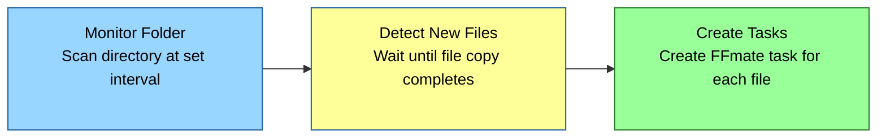

# Watchfolders

FFmate's **watchfolder** feature allows you to **automatically detect and process new files** in a specified directory. Once a watchfolder is configured, FFmate will **continuously scan** the folder for new or modified files and create **tasks** to process them based on a task preset. The watchfolder feature is useful for automatically transcoding footage from a camera SD card dropped into a network share or creating low-resolution versions of high-resolution files exported from an NLE for review.

## How Watchfolders Work

1. **Monitor a Folder** – FFmate scans the specified directory at a set interval.  
2. **Detect New Files** – When a new file is detected, FFmate ensures it’s **fully copied** before processing.   
3. **Create Tasks** – FFmate creates a **new FFmate [task](/docs/tasks.md)** for each detected file.  



## Creating a Watchfolder  

To create a watchfolder, send a `POST` request to the FFmate API:

```sh
curl -X POST http://localhost:3000/api/v1/watchfolders \
     -H "Content-Type: application/json" \
     -d '{
       "name": "Camera Card Watch",
       "description": "Automatically processes camera footage",
       "interval": 10,
       "growthChecks": 3,
       "preset": "cabfad2c-70d1-4df6-9267-f549a376301f",
       "path": "/volumes/media/camera_cards",
       "filter": {
         "extensions": {
           "exclude": ["tmp", "log"]
         }
       }
     }'
```

After you create a preset, FFmate responds with a JSON object that includes the `ID` of the newly created watchfolder.An `watchfolder.created` event is also fired via [webhooks](/docs/webhooks#watchfolder-events)

💡 Tip: Creating a new preset? You can define and save presets directly in the [FFmate Web UI](/docs/web-ui.md) without writing any API requests

## Watchfolder Properties

- **`name`** – A unique name for the watchfolder.  
- **`description`** – Optional description of what this watchfolder does.  
- **`interval`** – How often (in seconds) FFmate scans the folder for new files.  
- **`growthChecks`** – The number of checks FFmate performs to ensure a file is fully copied before processing.  
- **`preset`** – The ID of a predefined transcoding **preset** that will be applied to detected files.  
- **`path`** – The **absolute path** of the directory to monitor.  
- **`filter`** – Rules for file selection:  
  - **`include`** – Only process files with these extensions (e.g., `mp4`, `mov`).  
  - **`exclude`** – Ignore files with these extensions (e.g., `tmp`, `log`).  

::: tip How filters work  
FFmate always checks the `exclude` list **first**.  
If a file’s extension matches anything in `exclude`, the file will be skipped—**even if it also matches an extension in `include`**.

To keep things simple and predictable, it's best to use **either** `include` or `exclude`, not both at the same time.
:::

## How File Detection Works

FFmate ensures that only **fully copied** files are processed by using a **growth check validation**:  

1. A file is detected in the watchfolder.  
2. FFmate checks its **size**.  
3. If the size remains the same after multiple scans (determined by `growthChecks`), the file is processed.  
4. If the file is **still growing**, FFmate waits and continues checking until it stops changing.  

This prevents **incomplete** files from being prematurely processed.  

## Listing Watchfolders  

Send a `GET` request to the FFmate API to list all configured watchfolders.

```sh
curl -X GET 'http://localhost:3000/api/v1/watchfolders?page=0&perPage=10'
```

FFmate rreturns a JSON array containing all configured watchfolders. The `X-Total` response headers provides the total number of presets available.

**Query Parameters:**

- **`page`** *[optional]* – Specifies which page of results to retrieve. Default: `0`.
- **`perPage`** *[optional]* – Defines how many watchfolders should be included in each page. Default: `100`.

💡 Tip: Need an overview of all watchfolders? You can browse and manage them easily in the [FFmate Web UI](/docs/web-ui.md).

## Getting a Single Watchfolder

To retrieve the details of a specific watchfolder, send a `GET` request to the FFmate API, including the watchfolder's `ID` in the path.

```sh
curl -X GET http://localhost:3000/api/v1/watchfolders/{watchfolderId}
```

FFmate responds with a JSON object containing the full details of the specified watchfolder.

💡 Tip: Want a quick way to check the watchfolder details? You can view watchfolder configurations directly in the [FFmate Web UI](/docs/web-ui.md) without using the API.

## Updating a Watchfolder

You can update an existing watchfolder's configuration by sending a `PUT` request to the FFmate API, including the watchfolder's `ID` in the path. The request body should contain the complete, updated definition of the watchfolder. You can find a list of all available properties in the [Watchfolder Properties](#watchfolder-properties) section above.

```sh
curl -X PUT http://localhost:3000/api/v1/watchfolders/{watchfolderId} \
     -H "Content-Type: application/json" \
     -d '{
       "name": "Camera Card Watch",
       "description": "Processes high-res camera footage",
       "interval": 15,
       "growthChecks": 5,
       "preset": "uuid-of-updated-preset",
       "path": "/volumes/media/camera_cards_archive",
       "filter": {
         "extensions": {
           "include": ["mov", "mp4", "mxf"]
         }
       }
     }'
```

FFmate responds with the full JSON object representing the updated watchfolder. The watchfolder will restart with the new configuration shortly after the update. An `watchfolder.updated` event is also fired via [webhooks](/docs/webhooks#watchfolder-events)

💡 Tip: Making changes to a watchfolder? You can update settings like filters and intervals directly in the [FFmate Web UI](/docs/web-ui.md).

## Deleting a Watchfolder 

Send a `DELETE` request to the FFmate API to remove a watchfolder by including the watchfolder's `ID` in the path.

```sh
curl -X DELETE http://localhost:3000/api/v1/watchfolders/{watchfolderId} \
     -H "accept: application/json"
```

 FFmate responds with a 204 No Content status. The watchfolder will be removed from the system, and any monitoring for that folder will stop. An `watchfolder.deleted` event is also fired via [webhooks](/docs/webhooks#watchfolder-events)

💡 Tip: No need to send a delete request manually—you can remove watchfolders instantly from the [FFmate Web UI](/docs/web-ui.md).